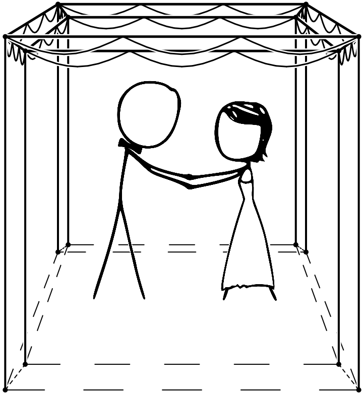

# Retroactive: Code from our wedding invitation (2009)

We ([@anpc](github.com/anpc) & [@cben](https://github.com/cben)) wanted something geeky and XKCD-ish for our wedding invitation and came up with a [Huppa](https://en.wikipedia.org/wiki/Huppa) extended in the 4th dimension, or a 4-dimensional [Cubiod](https://en.wikipedia.org/wiki/Cuboid) with frills:

Yes, we're strange :-)
The invitation details page (originally at bit.ly/huppoid -> sourceforge) included code to render it from different points of view.
I don't think anybody cares, but I wanted to release & preserve it...

I failed to find a good-looking direct 4D->2D projection so did a 4D->3D (resulting in cube-within-a-cube) followed by 3D->2D from *a different point*.  Apparently that's a well known way to visualize 4D — [Schlegel diagram](https://en.wikipedia.org/wiki/Schlegel_diagram).

The original 2009 version can be seen at https://rawgit.com/cben/huppoid/a6f4f499066606a427637b57b7cb0e4daa8c7ae4/output/huppa.html.
It was compiled to JavaScript with Pyjamas, now known as [Pyjs](http://pyjs.org/) and drew on a CANVAS tag.
a6f4f499066606a427637b57b7cb0e4daa8c7ae4 contains the latest source I found but I failed to find a Pyjamas version that will compile it correctly...

As Pyjs does browser sniffing and requires compilation, I figured [Brython](http://brython.info) which interprets Python 3 in-browser would be a better archival format.

> **=> https://cben.github.io/huppoid/huppa.html**

[Dev note: huppa.py is loaded via XHR which may not work from a `file://` local checkout, a web server is needed.]
Alas Brython turned out waaay slower than the 2009 version (even with Moore's law?!), but oh well.
(If I were to write it now, I'd have used something with 1:1 translation to JS such as Coffeescript or Rapydscript, or just raw JS.  And WebGL.)

I also found the z-order (aka painter's algorithm) was very lacking — it always drew all lines, then the fat points and the stick figures image last on top.
I somewhat improved the sorting but there are still some buggy angles, e.g. https://cben.github.io/huppoid/huppa.html#-5.0,3.0,4.0,5.0 .
I'm not sure it's even possible always find a correct drawing order without splitting objects or *per-pixel* z-buffer...

----------

## Attribution & License

Stick figures were shamelessly stolen from https://xkcd.com/489, formal attire from https://xkcd.com/422.
(Hint: XKCD scales up really well by [tracing with Inkscape](http://www.inkscape.org/doc/tracing/tutorial-tracing.html).)

The final invitation hazmana.jpg, hazmana2.jpg were designed by Vlad Kaminsky; I probably can license them as I see fit but not formally sure.

[CC0](http://creativecommons.org/publicdomain/zero/1.0/): I place *everything else here* under public domain / waive all rights to the extent possible.
